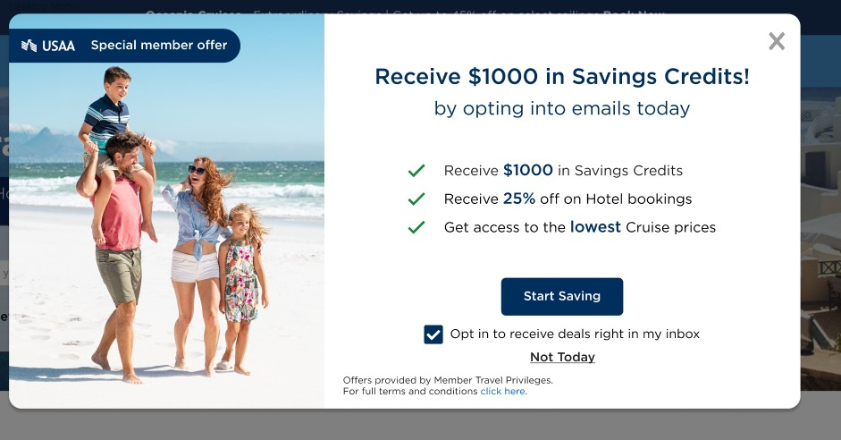

# USWW-HTML-CSS-Design--MY-first-project-For-client-
In my frontend career its my first project that i have made for my softare house client it is a simple responsive web page design
# USAA Card HTML/CSS Project

Welcome to the USAA Card HTML/CSS project repository! This project showcases a responsive landing page for a special member offer using HTML and CSS.




## Table of Contents

- [Description](#description)
- [Features](#features)
- [Preview](#preview)
- [Getting Started](#getting-started)
- [Customization](#customization)
- [Responsive Design](#responsive-design)
- [Technologies Used](#technologies-used)
- [Credits](#credits)
- [License](#license)

## Description

This project features a responsive landing page design for a special member offer using modern HTML and CSS techniques. The page includes an eye-catching background image, a label to highlight the offer's uniqueness, savings benefits with icons, and interactive user options.

## Features

- Responsive design adaptable to various screen sizes.
- Catchy label drawing attention to the offer.
- Highlighted savings with visually appealing icons.
- Interactive user input through a checkbox.
- Call to action with a "Start Saving" button.
- Footer with additional information and links.

## Preview


## Getting Started

1. Clone this repository:

   ```bash
   git clone https://github.com/your-username/usaa-card-project.git
## Customization
Feel free to customize the content, styling, and images to match your preferences. Modify the HTML and CSS files as needed to create your unique design.

## Responsive Design
The landing page is designed to be responsive and will adapt its layout for different screen sizes. Media queries have been used to optimize the display on various devices.

## Technologies Used
HTML5
CSS3
Credits
## Background image by Unsplash
Icons from FontAwesome
Fonts from Google Fonts
## License
This project is licensed under the MIT License. Feel free to use, modify, and distribute the code as needed.

This README template is created with ❤️ by [Muhammad Muzzammil]
